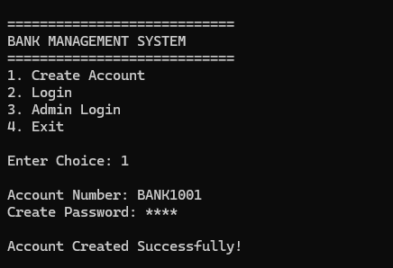
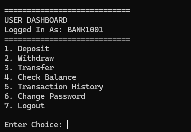
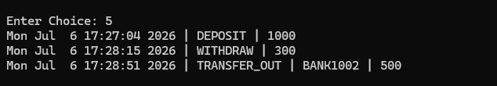
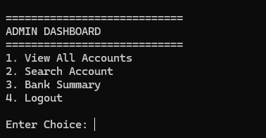
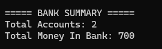
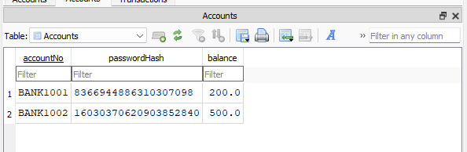

# Banking Management System

A secure command-line **Banking Management System** developed in **C++** using **SQLite** for persistent data storage. The application supports secure user authentication, banking operations, transaction management, and an administrative dashboard through a menu-driven interface.

---

## Project Overview

This project simulates the core functionalities of a banking system while demonstrating object-oriented programming principles and database integration using SQLite.

The application automatically creates the SQLite database (`bank.db`) during its first execution and stores all account and transaction data persistently.

It provides separate interfaces for users and administrators, supports persistent storage of account information and transaction history, and ensures reliable fund transfers using database transactions.

---

## Features

### User Features

- Create a new bank account
- Secure login with password hashing
- Deposit money
- Withdraw money
- Transfer funds to another account
- View account balance
- View complete transaction history
- Change account password
- Logout securely

### Admin Features

- Admin authentication
- View all customer accounts
- Search account by account number
- View bank summary statistics

### Database Features

- Persistent data storage using SQLite
- Prepared SQL statements
- Transaction logging
- Atomic fund transfers using COMMIT and ROLLBACK

---

## Tech Stack

**Language**
- C++

**Database**
- SQLite3

**Core Concepts**
- Object-Oriented Programming (OOP)
- SQL
- CRUD Operations
- Prepared Statements
- Database Transactions (COMMIT & ROLLBACK)
- Password Hashing
- Exception Handling

**Tools**
- Visual Studio Code
- Git

---

## Project Structure

```
Banking-System/
│
├── Bank.cpp
├── Bank.h
├── Database.cpp
├── Database.h
├── Transaction.cpp
├── Transaction.h
├── Utils.cpp
├── Utils.h
├── main.cpp
├── sqlite3.c
├── sqlite3.h
├── README.md
├── .gitignore
└── screenshots/
```

---

## Database Schema

### Accounts Table

| Column | Type | Description |
|---------|------|-------------|
| accountNo | TEXT | Primary key for each account |
| passwordHash | TEXT | Stores the hashed password |
| balance | REAL | Current account balance |

### Transactions Table

| Column | Type | Description |
|---------|------|-------------|
| id | INTEGER | Auto-increment transaction ID |
| timestamp | TEXT | Date and time of transaction |
| accountNo | TEXT | Account involved in the transaction |
| type | TEXT | Transaction type |
| otherAccount | TEXT | Sender/Receiver account (if applicable) |
| amount | REAL | Transaction amount |

---

## How to Run

### Prerequisites (Windows)

- GCC/G++ compiler (MinGW or MSYS2)
- Git
- Visual Studio Code (recommended)

### Clone the Repository

```bash
git clone https://github.com/SrihithKurelli/Banking-System.git
cd Banking-System
```

### Compile SQLite Library

```bash
gcc -c sqlite3.c -o sqlite3.o
```

### Build the Project

```bash
g++ -I. main.cpp Bank.cpp Database.cpp Transaction.cpp Utils.cpp sqlite3.o -o bank.exe
```

### Run

```bash
./bank.exe
```

> **Note:** The SQLite database (`bank.db`) is automatically created during the first execution. All account details and transaction history are stored persistently in this database.

---

## Application Workflow

1. Create a new bank account.
2. The password is securely hashed before being stored in the database.
3. Users authenticate using their account number and password.
4. Banking operations (deposit, withdrawal, and transfer) update the account balance in the SQLite database.
5. Every transaction is recorded in the `Transactions` table.
6. Administrators can monitor customer accounts and view overall bank statistics through a dedicated dashboard.

---

## Future Improvements

- Graphical User Interface (GUI)
- Interest calculation and loan management
- Monthly bank statement generation
- Export transaction history to CSV or PDF
- Role-based authentication with multiple administrator accounts
- Account locking after multiple failed login attempts

---

## Screenshots

### Account Creation



### User Dashboard



### Transaction History



### Admin Dashboard



### Bank Summary



### SQLite Database




